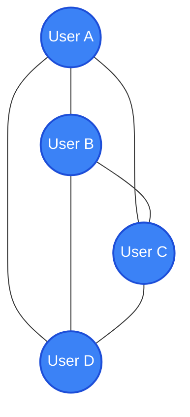
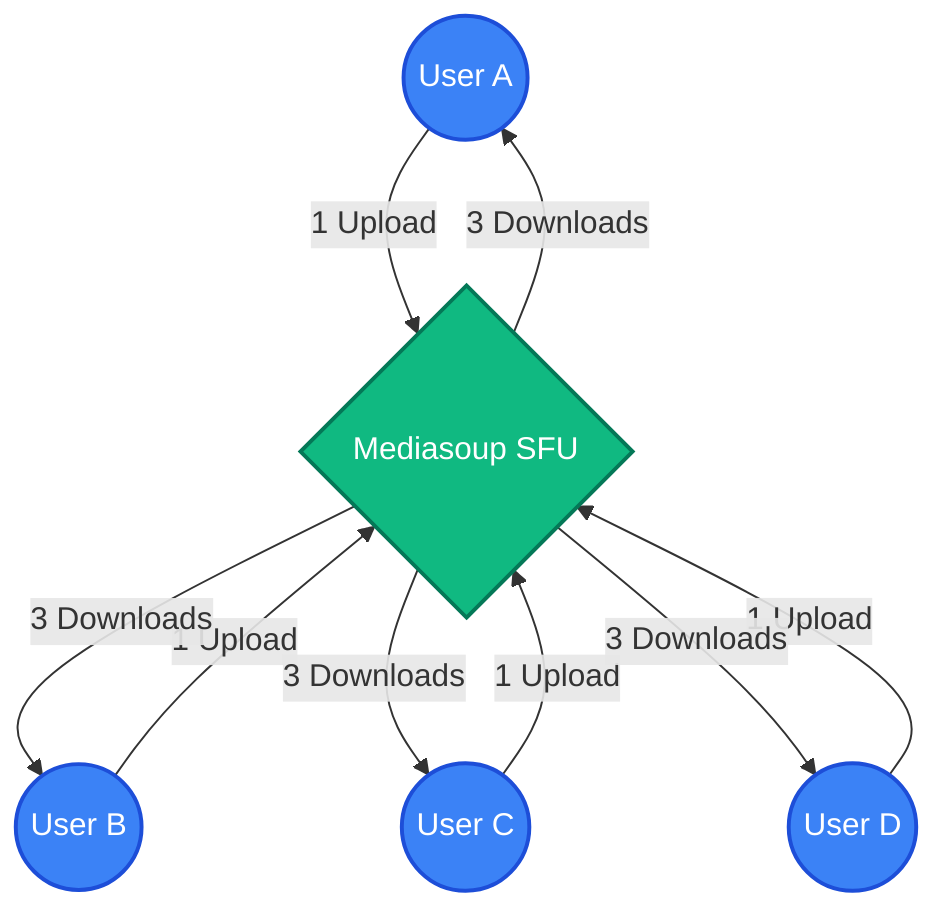

# 📡 LAN PULSE // Offline Mediasoup SFU Team Communicator

A lightweight, high-performance team communication web app designed for local networks (LAN / Wi-Fi) with **no cloud or internet dependency required**.

---

## 🎥 Group Video Calls & Mediasoup SFU Architecture

### 1. How to Start / Join a Group Call
1. Join any room (e.g., `#general` or `#engineering`).
2. Click the **"🎥 Join Room Call"** button in the header toolbar.
3. Your local camera & microphone will connect to the room's **Mediasoup SFU media session**.
4. Every room member can join simultaneously. Video tiles automatically populate in a square 1:1 grid.

---

### 2. Mediasoup SFU vs. Mesh Architecture

| Feature | SFU (Selective Forwarding Unit) | Traditional Mesh |
| :--- | :--- | :--- |
| **Connections Per Client** | **1 SendTransport + 1 RecvTransport** (Total: 2) | **N - 1 PeerConnections** (Grows quadratically) |
| **Upload Bandwidth** | **Constant** (~450 kbps, uploads 1 stream to SFU) | **N × Bandwidth** (Uploads 1 stream to *every* peer) |
| **Max Call Capacity** | **20 - 50+ Participants** | **4 - 6 Participants Max** |
| **Weak Connection Impact** | **Isolated to single user** | **Drags down all connected peers** |

---

### 3. Server Infrastructure & Hosting Requirements

Running an SFU introduces media routing responsibility to the host server machine:

- **Persistent Worker Process**: The server spawns a native C++ `mediasoup-worker` subprocess alongside Node.js to route RTP audio/video packets.
- **Port Ranges**:
  - Web Server & Signaling: `3000` (HTTPS) & `3001` (HTTP Redirect).
  - Mediasoup Media UDP/TCP Port Range: `40000 - 49999`. Ensure your local host firewall allows UDP traffic on these ports!
- **Resource Overhead**:
  - Memory: ~60 MB RAM base for Mediasoup worker + ~5 MB per active room session.
  - CPU: ~1-2% CPU usage per 720p video forwarding stream. A modern quad-core host laptop handles 20+ simultaneous streams easily on Wi-Fi.
- **Comparison to Mesh**:
  - *Original Mesh*: "Laptop on Wi-Fi" acts only as a light signaling & text relay server. Media flows directly between clients.
  - *SFU Setup*: Host laptop acts as a high-speed media router. The host must stay powered on and connected to the local network during calls.

---

## 🌐 Network Topology & Benefits

LAN Pulse is powered by a **Selective Forwarding Unit (SFU)** topology using Mediasoup. This architecture provides distinct advantages over other WebRTC topologies (Mesh and MCU), especially in local offline network environments.

### Visualizing the Topologies

#### 1. Traditional Mesh Topology (P2P)
In a Mesh network, every participant connects directly to every other participant. 
* **Connection Overhead**: $O(N^2)$ connections.
* **Upload Bandwidth**: Grows quadratically with every new participant.



#### 2. Mediasoup SFU Topology (LAN Pulse)
In our SFU network, each participant maintains only two connection transports: one to send their tracks, and one to receive incoming tracks.
* **Connection Overhead**: $O(N)$ connections.
* **Upload Bandwidth**: Constant upload stream size regardless of participant count.



### Core Benefits of this SFU Topology

1. **Bandwidth Optimization**:
   Because upload capacity is usually the main bottleneck on local Wi-Fi networks, SFU is highly beneficial. A client uploads its camera and microphone feed exactly **once** to the host server. The host server then routes the stream to other active peers. This prevents the client's upload bandwidth from saturating as more people join.
2. **Client CPU & Battery Conservation**:
   In a Mesh network, the client's browser has to encode its video feed multiple times (once for each peer, matching their respective network qualities). In an SFU network, the client encodes the stream only once. This keeps the client device cool, conserves battery life, and ensures smooth performance on older laptops or mobile devices.
3. **No External STUN/TURN Server Requirements**:
   In remote or offline LAN/Wi-Fi environments without internet access, routing is entirely handled by the local host server. Because WebRTC connections are made within the same subnet, there is no need for external STUN/TURN servers to traverse NAT firewalls.
4. **Resilient Downlink Allocation**:
   The SFU intelligently forwards streams based on dynamic network conditions. If a remote participant goes on mute or disables their camera, the SFU immediately stops forwarding the packets to other users, optimizing the download bandwidth.

---

## 📐 Fix: Square 1:1 Video Tile Grid (Root Cause & Solution)

### Root Cause of the Rectangle Tile Distortion Bug
Previously, video tiles used `aspect-ratio: 16 / 9` combined with rigid grid templates (`grid-template-columns: repeat(2, 1fr)`). As more participants joined, container bounds forced the tiles to stretch horizontally across the screen, turning square camera feeds into wide rectangular boxes and stretching faces.

### The Fix
1. **Locked 1:1 Square Aspect Ratio**: Applied `aspect-ratio: 1 / 1` on `.video-tile-card`. This guarantees width and height always scale together 1:1 as a perfect square, regardless of window size or participant count.
2. **Natural Camera Cropping**: Applied `object-fit: cover` to `<video>` elements. The camera feed fills the square tile naturally by cropping side margins, without any stretching or distortion.
3. **Auto-Fitting CSS Grid**: Configured `.call-video-workspace { grid-template-columns: repeat(auto-fit, minmax(200px, 1fr)); }`. As participants join or leave, tiles automatically reflow into a clean, balanced square grid.
4. **Local Mirroring & Labels**: The local user tile is mirrored (`transform: scaleX(-1)`), while remote tiles remain unmirrored. Each tile features a callsign label and a `🔇 Muted` badge when a participant mutes their microphone.

---

## ✨ On-Device Background Blur

### How it Works
- Click the **"✨" (Blur Background)** button during a call.
- Uses **on-device ML segmentation** (MediaPipe Selfie Segmentation) to isolate the human subject from the background in real-time.
- Composites the sharp foreground subject over a blurred background (`ctx.filter = 'blur(14px)'`) onto an offscreen canvas.
- Captures the processed video stream (`canvas.captureStream()`), re-attaches the original microphone audio track, and swaps the video track on the active WebRTC connection using `RTCRtpSender.replaceTrack()` (or Mediasoup `producer.replaceTrack()`) — **without renegotiating or dropping the call**.

### Internet-Dependency Caveat & Offline Graceful Fallback
- **Online Mode**: MediaPipe models load automatically from CDN when an internet link is present.
- **Offline / Isolated LAN Mode**: If running purely offline without internet access, the app **degrades gracefully**: it switches seamlessly to a high-speed Canvas center-weighted depth blur filter without throwing errors, breaking video feeds, or interrupting active calls.

---

## 🔒 Why HTTPS is Required

Modern web browsers (Chrome, Edge, Safari, Firefox) **strictly require a Secure Context (HTTPS)** for `navigator.mediaDevices.getUserMedia()`.

When accessing via a local network IP address (e.g. `https://192.168.x.x:3000` or `https://10.1.4.148:3000`), **HTTP blocks camera and microphone permissions**. LAN Pulse generates local SSL certificates automatically on startup to guarantee secure access on all LAN IPs.

### First-Time Browser Connection
Click **"Advanced"** -> **"Proceed to site (unsafe)"** on the initial certificate warning screen.

---

## 🧪 Automated Testing

An automated integration test script is included to verify SFU group calling, transport creation, stream production/consumption, and teardown:

```bash
# Run SFU integration test suite
node test/sfu_test.js
```

---

## 🎙️ RNNoise WebAssembly AI Real-Time Noise Suppression

### 1. Audio Processing Pipeline Order
Audio noise suppression occurs **100% on-device** directly within the client browser's Web Audio thread before reaching the WebRTC SFU network sender:

```
Raw Microphone Stream (with built-in echoCancellation & noiseSuppression floor)
   │
   ▼
MediaStreamAudioSourceNode
   │
   ▼
AudioWorkletNode ('rnnoise-worklet-processor') ──► [RNNoise WASM 480-sample frame processing @ 48kHz]
   │
   ▼
MediaStreamAudioDestinationNode
   │
   ▼
Clean MediaStreamTrack ──► WebRTC SFU SendTransport (Published to room)
```

### 2. Privacy & On-Device Processing
- **Strictly On-Device**: Audio data NEVER leaves the local machine for noise filtering. RNNoise runs as an Emscripten-compiled WebAssembly module inside the browser's dedicated `AudioWorklet` thread.
- **Default State**: RNNoise suppression is **ON by default** (matching Microsoft Teams standards) and can be toggled instantly during calls using the Denoise button (`#btn-toggle-denoise`) in the call toolbar.
- **Graceful Fallback**: If the WASM binary fails to load (or the browser lacks AudioWorklet support), the pipeline degrades gracefully to the raw microphone stream with the browser's built-in `noiseSuppression: true` floor intact, ensuring calls never fail or lose audio.

### 3. Technical Caveat
- **RNNoise Capabilities**: RNNoise uses a lightweight recurrent neural network (RNN) optimized for real-time performance on modest hardware. It excels at eliminating steady background noise such as fan whines, keyboard clicks, AC hums, and ambient traffic.
- **Commercial Comparison**: Because RNNoise is an open-source model, it will not suppress complex non-stationary noises as aggressively as paid commercial AI solutions like Krisp. If noise complaints persist in extreme acoustic environments, a commercial SDK like Krisp can be considered as the next tier.

## 🚀 Future Improvements & Roadmap

To make LAN Pulse even more robust and capable in air-gapped, high-security, or remote environments, we are tracking the following future enhancements:

- [ ] **100% Offline Background Blur Models**: Bundle MediaPipe model binaries directly within the application package (`public/models/`) to avoid CDN dependency on the very first load.
- [ ] **End-to-End Encryption (E2EE)**: Implement WebRTC Insertable Streams using SFrame to encrypt media packets, preventing local network eavesdropping on public or shared LAN subnets.
- [ ] **WebRTC Simulcast & SVC**: Introduce Simulcast for video streams, allowing the SFU to receive multiple resolutions (high, medium, low) and forward the best fit depending on a receiver's local signal strength.
- [ ] **LAN Auto-Discovery (mDNS / SSDP)**: Implement Multicast DNS so users can connect to the host by simply opening `https://lanpulse.local` in their browsers without typing raw local IP addresses.
- [ ] **Persistent Chat History & Session Database**: Integrate a lightweight, self-contained local database (such as SQLite or NeDB) to store encrypted text logs and room files across restarts.
- [ ] **Desktop & Mobile App Wrappers**: Package the app with Tauri or Electron to deliver native desktop and mobile binaries with LAN-friendly auto-start features.
- [ ] **Resilient Chunked File Sharing**: Add SHA-256 verification and automatic chunked pause/resume to the WebSockets file transfer pipeline to handle unstable Wi-Fi connections gracefully.

---

## 🤝 Contributing

Contributions make the open-source community an amazing place to learn, inspire, and create. Any contributions you make are **greatly appreciated**.

### Getting Started

1. **Prerequisites**:
   - Node.js (version 16 or newer recommended).
   - C++ compiler tools (required to compile the native Mediasoup worker):
     - **Windows**: Install `windows-build-tools` via npm or install Visual Studio with "Desktop development with C++".
     - **Mac / Linux**: Ensure `make`, `gcc`, and `g++` are installed in your shell path.
   - OpenSSL (pre-installed on macOS/Linux, or available via Git Bash on Windows) for automatic local HTTPS certificate generation.

2. **Setup Codebase**:
   ```bash
   # Clone the repository
   git clone https://github.com/Akshay08k/video-calling-offline.git
   
   # Go into project folder
   cd video-calling-offline
   
   # Install dependencies
   npm install
   ```

3. **Running in Development**:
   ```bash
   npm run dev
   ```
   Open your browser to the secure address shown in the terminal console output (e.g. `https://localhost:3000` or `https://192.168.x.x:3000`).

4. **Running the Test Suite**:
   Verify everything is configured correctly by running the integration tests:
   ```bash
   node test/sfu_test.js
   ```

### Contribution Guidelines

* **Offline-First Principle**: All components must be fully operational without requiring an active internet connection. Avoid linking external CDNs or external cloud APIs.
* **Keep it Light**: Minimize dependency usage. Prefer native browser APIs (Vanilla ES6 JS, CSS Grid, Web Audio API) where possible to maintain the high-performance profile.
* **Write Tests**: When introducing new signaling messages or WebRTC handling, add matching unit/integration tests to the `test/` folder.
* **Format Your Pull Request**: Keep commits clear, clean, and focused on a single change. Open a PR describing your implementation details and screenshots of tested features.

---

## ⚡ Technical Summary
- **Backend**: Node.js, Express, Socket.io, Mediasoup C++ SFU.
- **Frontend**: Vanilla JS (ES6+), Widescreen 4:3 Responsive CSS Grid, RNNoise WASM AudioWorklet, Canvas 2D, Web Audio API DSP.
- **Protocols**: WebRTC, SFU RTP, Binary ArrayBuffer socket file streaming.
